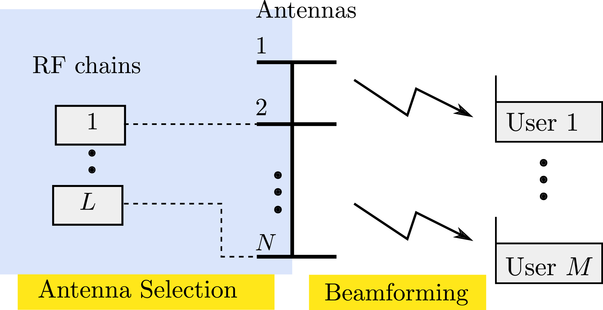
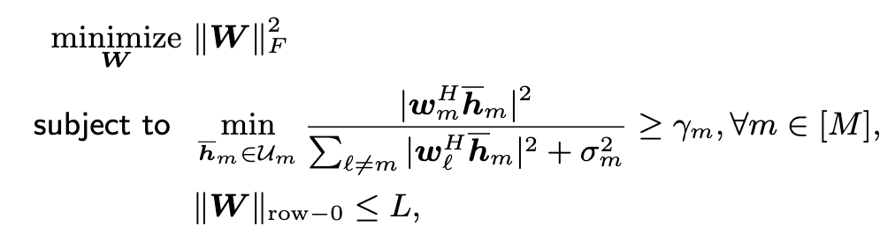
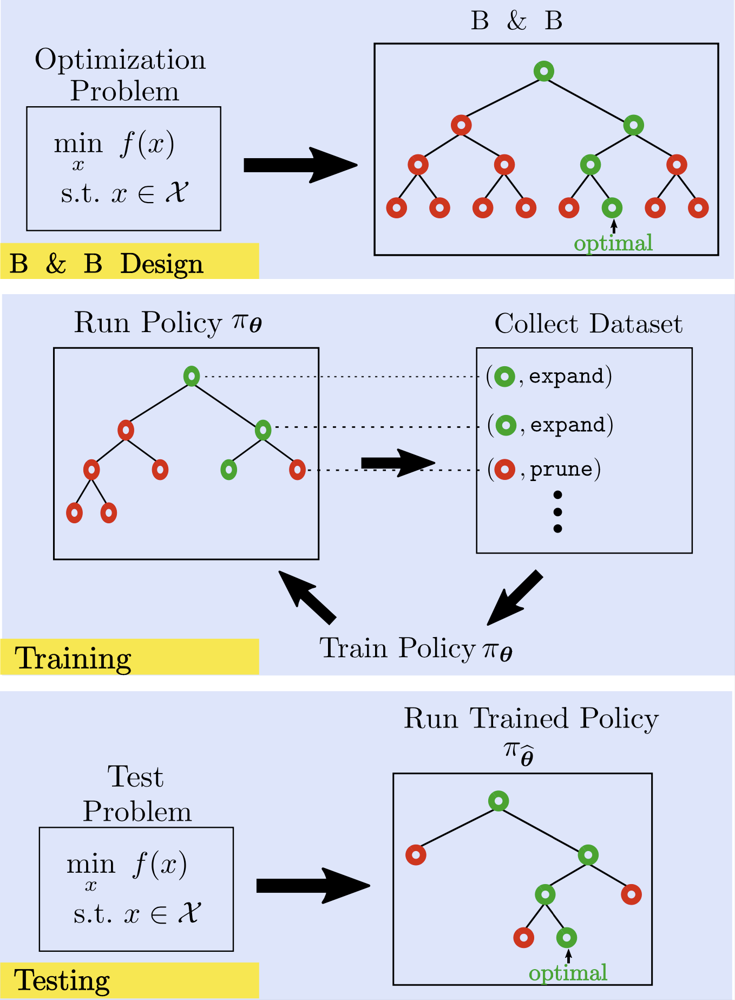
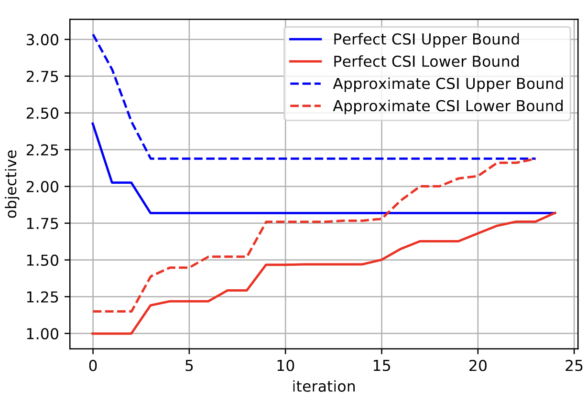
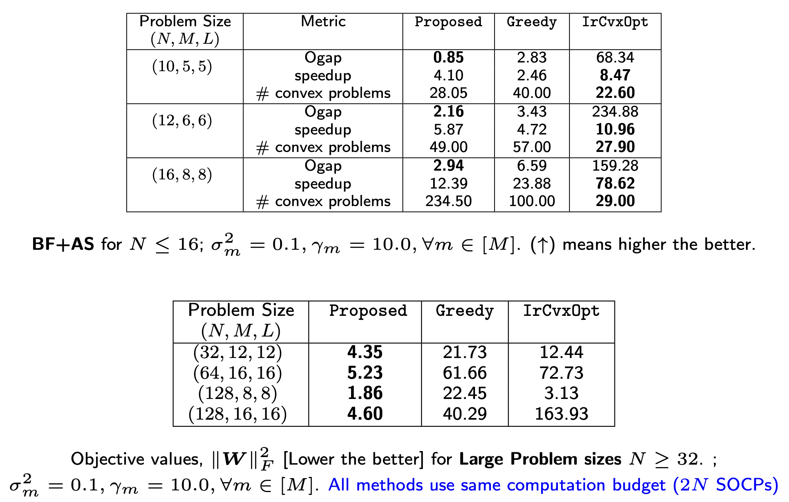

# Optimal Solutions for Joint Beamforming and Antenna Selection: From Branch and Bound to Machine Learning

Implementation of the paper "[Optimal Solutions for Joint Beamforming and Antenna Selection: From Branch and Bound to Graph Neural Imitation Learning](https://ieeexplore.ieee.org/stamp/stamp.jsp?arnumber=10043790)", published in IEEE Transactions on signal processing. Also, see a shorter version in [this ICASSP Paper](https://ieeexplore.ieee.org/abstract/document/10096331). 


## Beamforming and Antenna Selection Problem
<p align='center'>

</p>

<p align='center'>

</p>

## Proposed Solution
<!--  -->
<p align='center'>

</p>

## Results
<p align='center'>


</p>


## Setup
Make sure that you have pip installed. 

If you are on linux. Run the following command
```
./initial_setup.bash
```

Else, manually create the following directories 
```
antenna_selection/data_bf/data
antenna_selection/data_rbf/data

antenna_selection/data_bf/trained_models
antenna_selection/data_rbf/trained_models
```
And run 
```
pip install -r requirements.txt
```

## Executing the Code
On the base directory run the following to make sure that the repo is added to PATH and PYTHONPATH environment variables
```
source activate_env.bash
```

Finally, you can run the proposed B&B procedure by running the following  
```
python antenna_selection/bb_unified.py 
```

You can train node classifier with the following
```
python models/dagger_multiprocess.py
```

Change the parameters in models/setting.py and on the individual file that you are running.